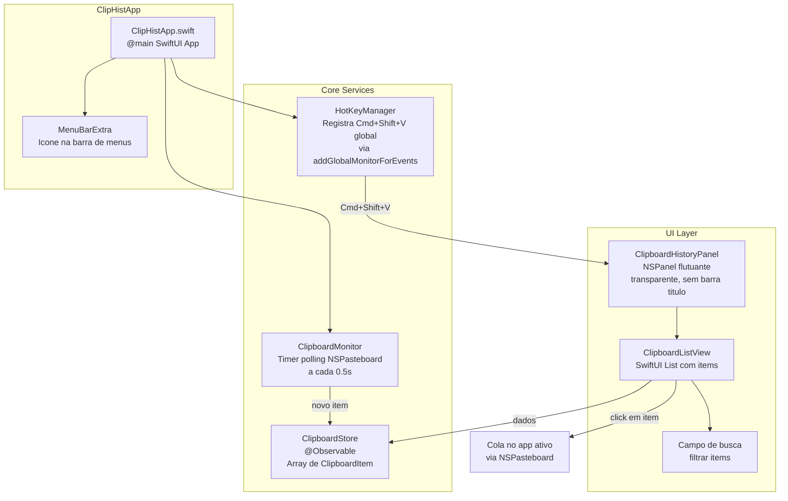

# Aplicacao Nativa macOS - Historico da Area de Transferencia

## Visao Geral

Aplicacao nativa macOS (menu bar app) que roda em background, monitora a area de transferencia continuamente e, ao pressionar **Cmd + Shift + V**, exibe um painel flutuante com a lista de tudo que foi copiado desde que o app foi aberto. O `Cmd + V` continua funcionando normalmente (colar direto).

## Stack Tecnica

- **Linguagem**: Swift 6 (moderno, com strict concurrency)
- **UI**: SwiftUI (macOS 13 Ventura+)
- **Projeto**: Xcode project (`.xcodeproj`)
- **Dependencias**: Nenhuma externa - apenas frameworks nativos da Apple
- **Armazenamento**: Apenas em memoria (`@Observable` / array in-memory)

## Arquitetura



## Estrutura de Arquivos

```
ClipHist/
  ClipHist.xcodeproj/
  ClipHist/
    ClipHistApp.swift              -- @main, MenuBarExtra
    Models/
      ClipboardItem.swift          -- struct com id, conteudo, timestamp, tipo
    Services/
      ClipboardMonitor.swift       -- polling NSPasteboard.general a cada 0.5s
      HotKeyManager.swift          -- registro de atalho global Cmd+Shift+V
      PasteService.swift           -- simula Cmd+V no app ativo
    Views/
      ClipboardHistoryPanel.swift  -- NSPanel wrapper (floating, key window)
      ClipboardListView.swift      -- lista principal com preview dos items
      ClipboardRowView.swift       -- cada linha da lista
      SettingsView.swift           -- tela basica de preferencias
    Resources/
      Assets.xcassets/             -- icone do app e da menu bar
      Info.plist
```

## Componentes Principais

### 1. ClipboardItem (Model)

```swift
struct ClipboardItem: Identifiable, Hashable {
    let id: UUID
    let content: String
    let timestamp: Date
    let type: ContentType  // .text, .image, .file
    let sourceApp: String? // nome do app de origem
    
    enum ContentType { case text, image, file }
}
```

### 2. ClipboardStore (Armazenamento em Memoria)

- Classe `@Observable` com array `[ClipboardItem]`
- Limite maximo configuravel (ex: 100 items)
- Metodos: `add(_:)`, `remove(_:)`, `clear()`, `pin(_:)`
- Deduplicacao: nao adiciona se o conteudo for identico ao ultimo

### 3. ClipboardMonitor (Monitoramento)

- Usa `Timer.scheduledTimer` com intervalo de 0.5 segundos
- Verifica `NSPasteboard.general.changeCount` - so processa se o count mudou
- Extrai texto via `NSPasteboard.general.string(forType: .string)`
- Adiciona ao `ClipboardStore`

### 4. HotKeyManager (Atalho Global)

- Usa `NSEvent.addGlobalMonitorForEvents(matching: .keyDown)` para capturar `Cmd + Shift + V` em qualquer app
- Tambem registra `NSEvent.addLocalMonitorForEvents` para quando o proprio app esta focado
- Ao detectar o atalho, mostra/esconde o painel flutuante

### 5. ClipboardHistoryPanel (Painel Flutuante)

- Subclasse de `NSPanel` com nivel `.floating`
- Aparece proximo ao cursor ou centralizado na tela
- Comportamento: aparece ao pressionar atalho, some ao clicar fora ou pressionar Esc
- Contém a `ClipboardListView` dentro via `NSHostingView`

### 6. ClipboardListView (Lista Principal)

- SwiftUI `List` com scroll
- Cada row mostra: preview do texto (truncado), timestamp relativo, icone do tipo
- Campo de busca no topo para filtrar
- Click em um item: copia para a area de transferencia e simula `Cmd+V` no app ativo
- Teclas de atalho: numeros 1-9 para selecao rapida

### 7. PasteService (Colar Automatico)

- Ao selecionar um item da lista:
  1. Coloca o conteudo no `NSPasteboard.general`
  2. Esconde o painel
  3. Simula `Cmd+V` via `CGEvent` para colar no app que estava ativo
- Requer permissao de Acessibilidade do macOS

### 8. Menu Bar

- `MenuBarExtra` com icone de clipboard na barra de menus
- Menu com opcoes: "Mostrar Historico", "Limpar Historico", "Preferencias", "Sair"
- Opcao de iniciar com o sistema via `SMAppService`

## Permissoes Necessarias (Info.plist / Entitlements)

- **Accessibility**: necessario para simular teclas (`Cmd+V`) em outros apps
- O app deve solicitar permissao de Acessibilidade na primeira execucao
- Entitlement `com.apple.security.app-sandbox` = NO (para monitorar atalhos globais sem sandbox)

## Fluxo de Uso

1. Usuario abre o app -- icone aparece na menu bar
2. App comeca a monitorar a area de transferencia em background
3. Usuario copia textos normalmente com `Cmd+C` em qualquer app
4. Ao pressionar `Cmd+Shift+V`, painel flutuante aparece com a lista
5. Usuario clica em um item (ou pressiona 1-9)
6. Item e colado no campo de texto do app que estava ativo
7. Painel some automaticamente

## Fora de Escopo (V1)

- Suporte a imagens e arquivos (apenas texto na V1)
- Persistencia em disco
- Sincronizacao entre dispositivos
- Snippets/templates
